# Pattern Demos

Pattern Demos is a collection of reusable processes, dialogs, and code snippets designed to enhance Axon Ivy projects. These demos, such as Lock, Job, and Admin Task, provide adaptable patterns for common scenarios like task management and error handling, requiring customization to fit specific project needs. Ideal for developers, they offer a starting point to streamline implementation while leveraging additional infrastructure like database connections.

## Key features

- Ready-to-use demo processes and dialogs that accelerate implementation and learning.
- Simplify job automation with scheduled and manual job patterns integrated with Admin Tasks.
- Prevent race conditions using built-in locking utilities for reliable concurrent processing.
- Reusable UI form components and dialogs for faster user interface assembly.
- Preview PDFs and handle ZIP file operations directly in your Axon Ivy flows.
- Packaged Maven artifacts for easy import and modular deployment.

## Demo

Check the demo implementations provided across the modules. Each demo illustrates a focused scenario (Lock, Job, PDF Viewer, Zip, etc.) and can be run in a local Axon Ivy runtime.

### Demo workflows

#### pattern-demos-admintask (pattern-demos-admintask)

##### Admin Task

1. Launch the Admin Task demo from the demo menu.
2. The demo creates an admin task to review background errors or decisions.

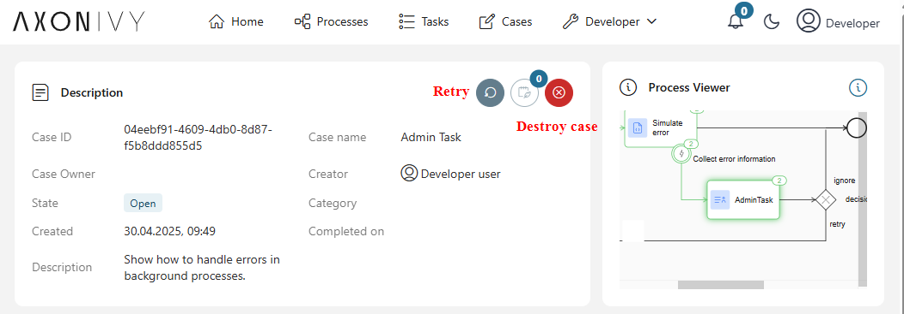

3. Choose an action (Retry, Ignore, Check later) to resolve or escalate.

#### pattern-demos-components (pattern-demos-components)

##### Components

1. Launch the Components demo from the demo menu.
2. Interact with the demo UI to create and update components and sub-components.

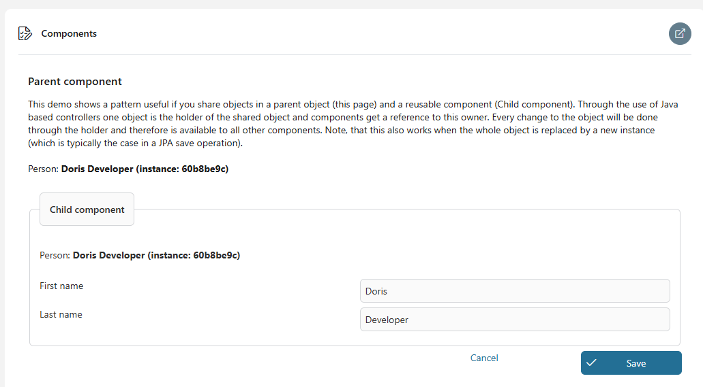

3. Observe the resulting dialogs and confirmation messages.
4. Use the provided dialogs to save and persist component state.

#### pattern-demos-job (pattern-demos-job)

##### Manual job run

1. Launch the Manual job run demo from the demo menu.
2. Fill in the job parameters and start the job.
3. An Admin Task is created to review job results and decide on retry or ignore.

##### Automatic job run

1. The Automatic job run is triggered by a timer (configured via a global variable).
2. The job runs in the background; failures generate an Admin Task for follow-up.

#### pattern-demos-lock (pattern-demos-lock)

##### Lock

1. Launch the Lock demo from the demo menu.
2. Click the button to acquire the demo lock.

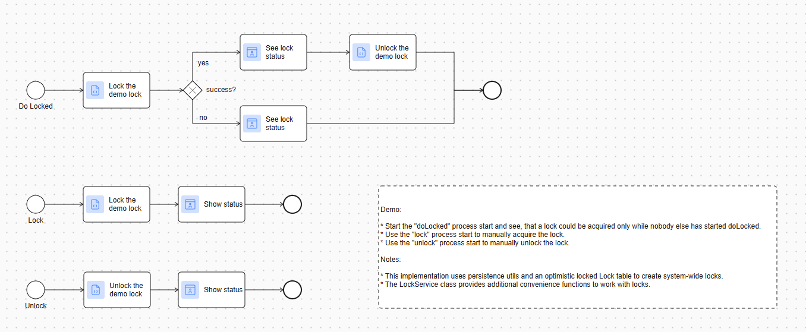

3. Observe the confirmation dialog showing the lock state.
4. If the lock is already taken, the demo explains how to resolve it.

##### Do Locked

1. Start the Do Locked demo from the demo menu.
2. The process attempts to acquire the lock and runs only when the lock is available.

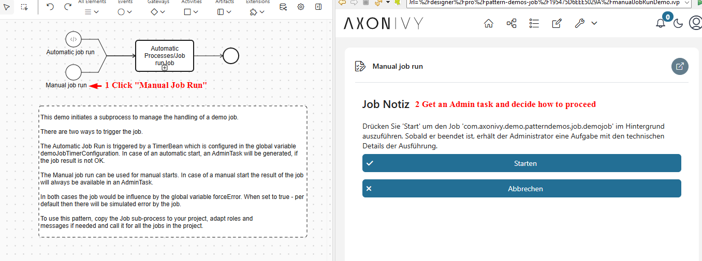

3. Observe the behaviour and the status dialog that shows whether the action succeeded.

##### Unlock

1. Launch the Unlock demo from the demo menu.
2. Click to release the demo lock.
3. Confirm the unlock status in the resulting dialog.

#### pattern-demos-paralleltasks (pattern-demos-paralleltasks)

##### Parallel Tasks

1. Launch the Parallel Tasks demo from the demo menu.
2. The process creates a group of parallel tasks (e.g., 3 tasks).

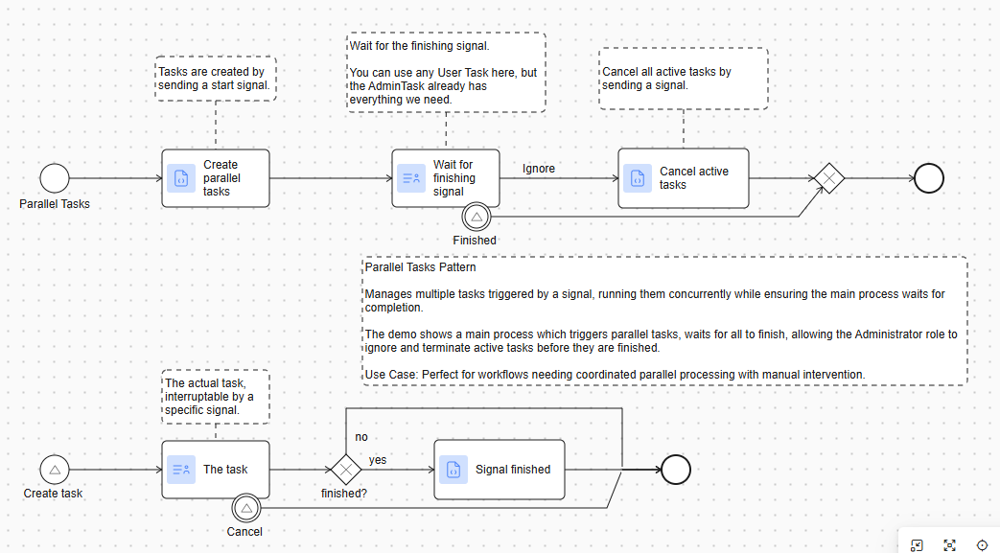

3. Monitor or cancel individual tasks as needed.
4. The main process waits until all parallel tasks are finished.

#### pattern-demos-pdfviewer (pattern-demos-pdfviewer)

##### View PDF document

1. Launch the View PDF document demo from the demo menu.
2. Upload a PDF file or select one to preview.

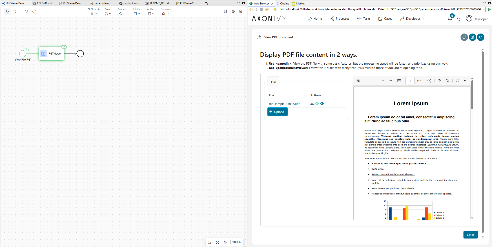

3. The PDF displays in the viewer for preview and navigation.
4. Use viewer controls to zoom or download the document if available.

#### pattern-demos-placeholder (pattern-demos-placeholder)

##### Placeholder Replacement

1. Launch the Placeholder demo to explore placeholder functionality.
2. Follow on-screen instructions to exercise replacement or transformation features.

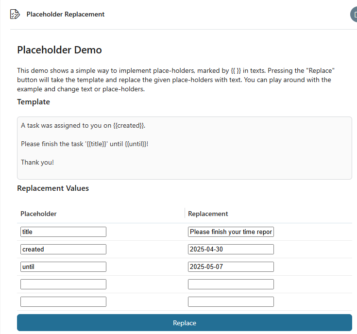

#### pattern-demos-primefacesextensions (pattern-demos-primefacesextensions)

##### Primefaces Extensions Demo

1. Launch the Primefaces Extensions demo.
2. Interact with enhanced UI components demonstrating the extensions.

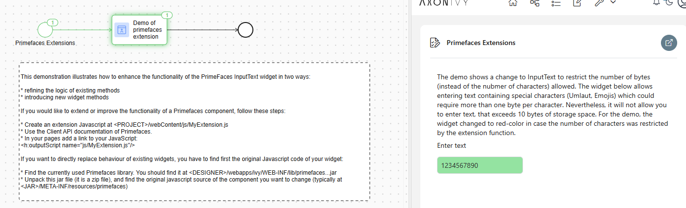

3. Use the demo to copy patterns into your own UI implementations.

#### pattern-demos-validation (pattern-demos-validation)

##### Basic validation

1. Launch the Basic validation demo.
2. Fill a field with invalid input to see immediate validation feedback.

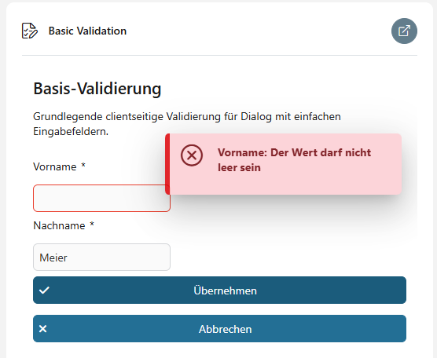

3. Correct the input and confirm the validation passes.

##### Server side validation

1. Launch the Server side validation demo.
2. Provide inputs that require model-based or server-side validation.
3. Review validation errors returned from the server and resolve them.

#### pattern-demos-zip (pattern-demos-zip)

##### Zip Demo

1. Open the Zip demo dialog.
2. Upload or select files to include in the archive.

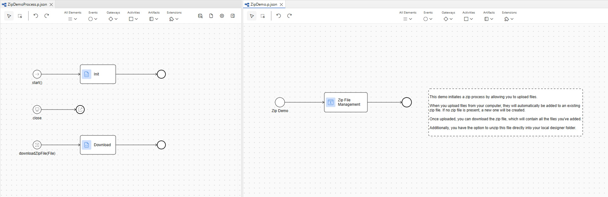

3. Click the download action to receive the zipped file.
4. Optionally unzip the file into your local designer folder.

#### pattern-demos-waitingevent (pattern-demos-waitingevent)

##### Start Waiting

1. Launch the Start Waiting demo from the demo menu.
2. The demo creates a waiting task and provides an Event ID in the runtime log.

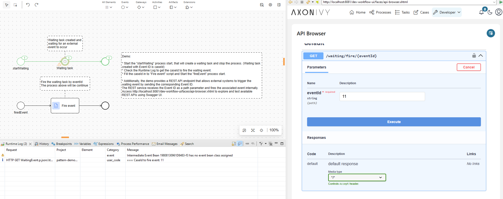

3. Retrieve the Event ID from the runtime log.
4. Use the Fire Waiting Event demo or the REST API to trigger the waiting event and resume the task.

##### Fire Waiting Event

1. Launch the Fire Waiting Event demo.
2. Enter the Event ID and execute the action to fire the event.
3. The corresponding waiting task resumes and completes.

## Setup

- **Roles:** - No information was delivered for this section.
- **OpenAPI:** No public OpenAPI specs delivered by this extension.

### Variables

- No variables were detected.

- No information was delivered for this section.

## Components

### Connector Processes

#### Job.p.json

- **runJob(String jobName, Boolean manual) -> (none)**
    - Input:
        - `jobName` (String) - The name of the job to run
        - `manual` (Boolean) - Whether this is a manual run
    - Result:
        - (none)

### Form Components

#### ParentData — UI controller holder

- **Namespace:** com.axonivy.demo.patterndemos.Parent
- **Component type:** Data Class
- **Fields:**
   - `ctrl` (com.axonivy.demo.patterndemos.ui.ParentCtrl) — controller instance (persistent)

#### ChildData — UI controller holder

- **Namespace:** com.axonivy.demo.patterndemos.components.Child
- **Component type:** Data Class
- **Fields:**
   - `ctrl` (com.axonivy.demo.patterndemos.ui.components.ChildCtrl) — controller instance (persistent)

### Maven artifacts

1. pattern-demos-admintask

```xml
<dependency>
  <groupId>com.axonivy.demo.patterndemos</groupId>
  <artifactId>pattern-demos-admintask</artifactId>
  <version>@version@</version>
  <type>iar</type>
</dependency>
```

2. pattern-demos-components

```xml
<dependency>
  <groupId>com.axonivy.demo.patterndemos</groupId>
  <artifactId>pattern-demos-components</artifactId>
  <version>@version@</version>
  <type>iar</type>
</dependency>
```

3. pattern-demos-job

```xml
<dependency>
  <groupId>com.axonivy.demo.patterndemos</groupId>
  <artifactId>pattern-demos-job</artifactId>
  <version>@version@</version>
  <type>iar</type>
</dependency>
```

4. pattern-demos-lock

```xml
<dependency>
  <groupId>com.axonivy.demo.patterndemos</groupId>
  <artifactId>pattern-demos-lock</artifactId>
  <version>@version@</version>
  <type>iar</type>
</dependency>
```

5. pattern-demos-paralleltasks

```xml
<dependency>
  <groupId>com.axonivy.demo.patterndemos</groupId>
  <artifactId>pattern-demos-paralleltasks</artifactId>
  <version>@version@</version>
  <type>iar</type>
</dependency>
```

6. pattern-demos-placeholder

```xml
<dependency>
  <groupId>com.axonivy.demo.patterndemos</groupId>
  <artifactId>pattern-demos-placeholder</artifactId>
  <version>@version@</version>
  <type>iar</type>
</dependency>
```

(Additional artifacts omitted for brevity)
