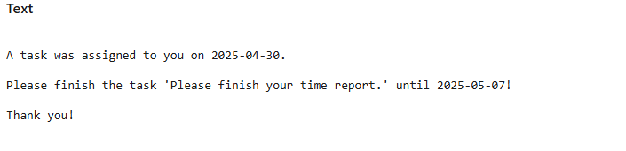

# Pattern Demos

Pattern Demos is a collection of reusable Axon Ivy patterns you can copy, adapt, and combine in your own solutions.


It helps you accelerate implementation for common process challenges such as background error handling, task synchronization, validation, file handling, and UI composition.

**Key features**

- Manage background work with admin follow-up tasks, including job handling and waiting events when a process needs to pause and resume later.
- Reuse shared UI components to keep parent and child dialogs synchronized while saving shared state safely.
- Coordinate parallel and locked work so multiple tasks run without conflicts and can be controlled from one place.
- Validate forms from simple required fields to full server-side model checks before a user continues.
- Move documents and files through ZIP upload/download flows and PDF viewing without leaving the app.
- Extend PrimeFaces widgets and placeholder replacement behavior to tailor the UI for specific use cases.

## Demo

Explore the demo modules below to see how each pattern behaves in a real app. For the broader repository context, see the root [README](../README.md).

### Demo Workflows

#### Admin Task (pattern-demos-admintask)


##### Admin Task

1. Start the Admin Task demo.
2. Let the background process raise the simulated error and hand you an administrator task.
3. Review the task details and choose whether to retry, ignore, or check later.
4. Confirm your choice and watch the process continue or stop.

#### Components (pattern-demos-components)

##### Components

1. Start the Components demo.
2. Review the parent person object shown on the page.
3. Change values inside the child component.
4. Save the page and see the shared state stay in sync.

#### Job (pattern-demos-job)

##### Manual job run

1. Start the manual job run demo.
2. Review the background job note and launch the job manually.
3. If the job needs attention, open the admin task and inspect the result.
4. Retry, check later, or continue based on the outcome.

#### Lock (pattern-demos-lock)


##### Lock

1. Start Lock to acquire the demo lock manually.
2. Review the status message that confirms whether the lock was set.
3. Keep the lock in place while another process is running.

##### Do Locked

1. Start Do Locked while the lock is already held.
2. Observe whether the process can continue or whether it has to wait.
3. Unlock the demo and try again if the lock is still busy.

##### Unlock

1. Start Unlock to release the demo lock.
2. Check the status message that confirms the unlock result.
3. Run the other demo again to verify the lock is available.

#### Parallel Tasks (pattern-demos-paralleltasks)


##### Parallel Tasks

1. Start the Parallel Tasks demo.
2. Let the process create a small group of tasks in parallel.
3. Complete the tasks or use the administrator task to postpone, ignore, or cancel them.
4. Return to the main process once every task is finished.

#### Placeholder Replacement (pattern-demos-placeholder)




##### Placeholder Replacement

1. Start the placeholder replacement demo.
2. Edit the template text or the replacement table.
3. Click Replace to substitute the placeholder values.
4. Review the generated text and finish when you're done.

#### PrimeFaces Extensions (pattern-demos-primefacesextensions)


##### Primefaces Extensions

1. Start the PrimeFaces Extensions demo.
2. Enter text that contains umlauts or emoji.
3. Watch the input enforce a 10-byte limit instead of a simple character count.
4. Notice how the widget changes when the extension blocks more input.

#### Validation (pattern-demos-validation)


##### Basic Validation

1. Start the basic validation demo.
2. Fill in the first name and last name fields.
3. Click Apply to trigger client-side validation.
4. Fix missing values and continue once the form is valid.

##### Server Side Validation

1. Start the server-side validation demo.
2. Set the start date and then choose the from/to dates.
3. Use Apply for full validation or Intermediate Save when you want to store partial input.
4. Review the validation messages and continue only when the dates are valid.

#### ZIP Demo (pattern-demos-zip)


##### Zip Demo

1. Start the ZIP demo.
2. Upload one or more files to add them to the archive.
3. Download the ZIP file or unpack it into the local designer folder.
4. Review the archive contents and total sizes.

#### PDF Viewer (pattern-demos-pdfviewer)


##### View PDF document

1. Start the PDF viewer demo.
2. Upload a PDF file from your computer.
3. Switch between the two viewer modes to compare the output.
4. Download the file again if you want to confirm the document flow.

#### Waiting Event (pattern-demos-waitingevent)


##### Start Waiting

1. Start the waiting event demo.
2. Note the generated event ID in the log and keep the waiting task open.
3. Fire the matching event from the second demo start or via `http://localhost:8081/dev-workflow-ui/faces/api-browser.xhtml`.
4. Watch the waiting case continue once the event is received.

##### Fire Waiting Event

1. Start the fire event workflow.
2. Reuse the event ID from the waiting process.
3. Start the fire action to trigger the waiting event.
4. Confirm that the waiting process continues.

## Setup

This repository keeps configuration close to each demo module. There is no shared setup guide in the product module; each module carries its own variables and runtime behavior.

- **Roles:** Everybody (configured in config/roles.xml)
- **OpenAPI:** No information was delivered for this section.

Some workflows create administrator tasks at runtime, so you need an Administrator role in the runtime even though the repository role file currently only defines Everybody.

### Variables

```text
@variables.yaml@
```

## Components

### Callable Subprocesses

The repository exposes one callable subprocess that handles the registered job pattern.

#### Functional Processes/Job.p.json

- **Signature**: runJob(String jobName, Boolean manual)
    - Input:
        - `jobName` (String) - Name of the job to run.
        - `manual` (Boolean) - Marks whether the job was started manually.
    - Result: (none)
- **Purpose:** Executes the registered job and lets the surrounding process decide whether the result needs admin review.

### Dialog Components

#### AdminTask — Lets administrators decide how a failing background step should continue
- **Namespace:** com.axonivy.demo.patterndemos.admintask.AdminTask
- **Component type:** UI dialog
- **Fields:**
  - `task` (String) - Task title shown to the administrator.
  - `details` (String) - Additional execution details shown in the dialog.
  - `buttons` (List<com.axonivy.demo.patterndemos.admintask.enums.AdminDecision>) - Decision buttons that appear in the dialog.
- **Purpose:** Presents a review task for background failures and lets the user retry, ignore, or postpone the work.

#### Parent — Hosts the reusable parent/child synchronization example
- **Namespace:** com.axonivy.demo.patterndemos.Parent
- **Component type:** Component dialog
- **Fields:** - (none)
- **Purpose:** Shows how a parent dialog keeps shared state and a child component synchronized during saves.

#### Child — Edits the shared person object inside the reusable component
- **Namespace:** com.axonivy.demo.patterndemos.components.Child
- **Component type:** Component dialog
- **Fields:**
  - `childCtrl` (com.axonivy.demo.patterndemos.ui.components.ChildCtrl) - Controller reference passed from the parent dialog.
- **Purpose:** Lets the reusable child component edit the shared person data.

#### JobBackgroundNote — Explains the job run and unlock flow
- **Namespace:** com.axonivy.demo.patterndemos.job.JobBackgroundNote
- **Component type:** UI dialog
- **Fields:**
  - `jobName` (String) - Name of the job shown in the note dialog.
- **Purpose:** Shows whether the job is locked and lets the user start or unlock it.

#### LockDemo — Shows the lock status and the next action
- **Namespace:** com.axonivy.demo.patterndemos.lock.LockDemo
- **Component type:** UI dialog
- **Fields:**
  - `message` (String) - Status message displayed in the dialog.
- **Purpose:** Displays the current lock status and lets the user continue after locking or unlocking the demo lock.

#### DemoTask — Represents one task in the parallel task demo
- **Namespace:** com.axonivy.demo.patterndemos.paralleltasks.DemoTask
- **Component type:** UI dialog
- **Fields:**
  - `demoData` (com.axonivy.demo.patterndemos.paralleltasks.pojos.DemoData) - Shared task metadata for this parallel task instance.
- **Purpose:** Shows one parallel task and lets the user complete it or postpone it for later.

#### PlaceholderDemo — Demonstrates placeholder replacement
- **Namespace:** com.axonivy.demo.patterndemos.placeholder.PlaceholderDemo
- **Component type:** UI dialog
- **Fields:** - (none)
- **Purpose:** Provides a template editor and replacement table for placeholder substitution.

#### PdfViewerDemo — Lets users upload and preview PDF documents
- **Namespace:** com.axonivy.demo.patterndemos.pdfviewer.PdfViewerDemo
- **Component type:** UI dialog
- **Fields:** - (none)
- **Purpose:** Lets the user upload a PDF, preview it in two viewer modes, and download the file again if needed.

#### PrimefacesExtensions — Demonstrates the byte-based text limit extension
- **Namespace:** com.axonivy.demo.patterndemos.primefacesextensions.PrimefacesExtensions
- **Component type:** UI dialog
- **Fields:** - (none)
- **Purpose:** Shows how a PrimeFaces input can be extended to limit input by bytes instead of characters.

#### BasicValidation — Demonstrates required-field validation
- **Namespace:** com.axonivy.demo.patterndemos.validation.BasicValidation
- **Component type:** UI dialog
- **Fields:** - (none)
- **Purpose:** Presents a simple form that demonstrates client-side validation for required fields.

#### ServerSideValidation — Demonstrates client-side and server-side date checks
- **Namespace:** com.axonivy.demo.patterndemos.validation.ServerSideValidation
- **Component type:** UI dialog
- **Fields:** - (none)
- **Purpose:** Shows how to validate dates on the client and on the server, including intermediate save behavior.

#### ZipDemo — Manages file uploads, ZIP creation, and unpacking
- **Namespace:** com.axonivy.demo.patterndemos.zip.ZipDemo
- **Component type:** UI dialog
- **Fields:** - (none)
- **Purpose:** Lets users upload files, build a ZIP archive, download it, or unpack it locally.

### Web Services

- No information was delivered for this section.
### Maven Artifacts

1. pattern-demos-admintask

```xml
<dependency>
  <groupId>com.axonivy.demo.patterndemos</groupId>
  <artifactId>pattern-demos-admintask</artifactId>
  <type>iar</type>
</dependency>
```

2. pattern-demos-components

```xml
<dependency>
  <groupId>com.axonivy.demo.patterndemos</groupId>
  <artifactId>pattern-demos-components</artifactId>
  <type>iar</type>
</dependency>
```

3. pattern-demos-job

```xml
<dependency>
  <groupId>com.axonivy.demo.patterndemos</groupId>
  <artifactId>pattern-demos-job</artifactId>
  <type>iar</type>
</dependency>
```

4. pattern-demos-lock

```xml
<dependency>
  <groupId>com.axonivy.demo.patterndemos</groupId>
  <artifactId>pattern-demos-lock</artifactId>
  <type>iar</type>
</dependency>
```

5. pattern-demos-paralleltasks

```xml
<dependency>
  <groupId>com.axonivy.demo.patterndemos</groupId>
  <artifactId>pattern-demos-paralleltasks</artifactId>
  <type>iar</type>
</dependency>
```

6. pattern-demos-placeholder

```xml
<dependency>
  <groupId>com.axonivy.demo.patterndemos</groupId>
  <artifactId>pattern-demos-placeholder</artifactId>
  <type>iar</type>
</dependency>
```

7. pattern-demos-primefacesextensions

```xml
<dependency>
  <groupId>com.axonivy.demo.patterndemos</groupId>
  <artifactId>pattern-demos-primefacesextensions</artifactId>
  <type>iar</type>
</dependency>
```

8. pattern-demos-validation

```xml
<dependency>
  <groupId>com.axonivy.demo.patterndemos</groupId>
  <artifactId>pattern-demos-validation</artifactId>
  <type>iar</type>
</dependency>
```

9. pattern-demos-zip

```xml
<dependency>
  <groupId>com.axonivy.demo.patterndemos</groupId>
  <artifactId>pattern-demos-zip</artifactId>
  <type>iar</type>
</dependency>
```

10. pattern-demos-pdfviewer

```xml
<dependency>
  <groupId>com.axonivy.demo.patterndemos</groupId>
  <artifactId>pattern-demos-pdfviewer</artifactId>
  <type>iar</type>
</dependency>
```

11. pattern-demos-waitingevent

```xml
<dependency>
  <groupId>com.axonivy.demo.patterndemos</groupId>
  <artifactId>pattern-demos-waitingevent</artifactId>
  <type>iar</type>
</dependency>
```
