# Muster-Demos

Musterdemos sind eine Sammlung von Prozessen, Dialogen, Code und anderen
Schnipseln, die sich in unseren Projekten als nützlich erwiesen haben und über
diese Market Extension als Best Practices öffentlich geteilt werden.\
Um ein Muster zu verwenden, kopieren Sie die erforderlichen Teile in Ihr Projekt
und passen Sie sie nach Bedarf an. Die Demos sind so einfach wie möglich
gehalten, einige erfordern jedoch möglicherweise zusätzliche Infrastruktur in
Ihrem Projekt.

Im Einzelnen finden Sie Lösungen für die folgenden typischen Probleme:
- **Admintask-**: Bei Fehlern in der Prozessausführung erhält ein Administrator
  eine Aufgabe und kann entscheiden, wie weiter vorgegangen werden soll.
- **Komponente „** “: Diese Demo zeigt, wie verschiedene Teile einer
  Benutzeroberfläche dieselben Daten einfach gemeinsam nutzen und aktualisieren
  können, indem sie über einen gemeinsamen Controller verbunden werden, sodass
  Änderungen immer synchronisiert sind.
- **Lock-**: Verhindert die mehrfache Ausführung einer Aufgabe.
- **Job-**: Dieses Muster hilft Ihnen bei der Verwaltung automatisierter
  Backend-Jobs in Axon Ivy. Es bietet Optionen zum manuellen Starten der Jobs
  und zur Fehlerbehandlung über Admin-Aufgaben, wodurch sich Jobs einfacher
  steuern, überwachen und nach Ausfällen wiederherstellen lassen.
- **Paralleltasks**: Dieses Muster hilft bei der Verwaltung mehrerer
  gleichzeitig ausgeführter Aufgaben.
- **Platzhalter-**: Ersetzen Sie Platzhalter im Text (wie `{{name}}`) durch
  echte Werte, indem Sie einen integrierten Dienst verwenden.
- **Primefaceextension**: Anhand dieser Beispiele können Sie sehen, wie
  Primefaces-Widgets mithilfe der clientseitigen API von Primefaces angepasst
  werden können.
- **Validierungs-**: Stellt sicher, dass die Benutzereingaben korrekt sind,
  indem erforderliche Felder, gültige Werte und Feldkombinationen überprüft
  werden.
- **ZIP-**: Diese Demo zeigt ein Beispiel für die Verwendung der ZIP-Funktion.
- **PDFViewer**: Diese Demo zeigt, wie man PDF-Dateien hochlädt und anzeigt.
- **Warten auf Ereignis**: Diese Demo zeigt, wie Sie die Ausführung eines
  Prozesses unterbrechen und fortsetzen können, wenn ein externes Ereignis
  eintritt.

## Demo

### Admin-Aufgabe

Verwenden Sie eine Admin-Aufgabe, um Fehler in unbeaufsichtigten Backend-Jobs zu
erkennen. Im Falle von Fehlern erhält eine Admin-Rolle eine Aufgabe mit den
Ergebnissen und kann entscheiden, ob der Job wiederholt oder übersprungen werden
soll.

Diese Demo erstellt einen Hintergrundprozess **background process**, der vom
System ausgeführt wird und absichtlich einen Fehler auslöst. Der Fehler wird in
einem AdminTask **AdminTask** angezeigt, wo ein Administrator wählen kann, ob er
**den Prozess erneut versuchen** oder **den Fehler ignorieren** möchte. Vor dem
erneuten Versuch sollte das Problem manuell behoben werden. In dieser Demo kann
der „Fehler” behoben werden, indem die globale Variable `forceError` auf `false`
gesetzt und dann erneut versucht wird.

Sie können **den Dialog** in Ihrem eigenen Projekt wiederverwenden und diesem
Muster folgen, wann immer Sie Hintergrundfunktionen ausführen und Fehler
sichtbar behandeln möchten.

> **Hinweis:** Stellen Sie sicher, dass das Flag „ `persist”` für die Parameter
> „ `” task` und „ `” detail` gesetzt ist, damit sie verfügbar bleiben, wenn der
> Administrator die Aufgabe öffnet!

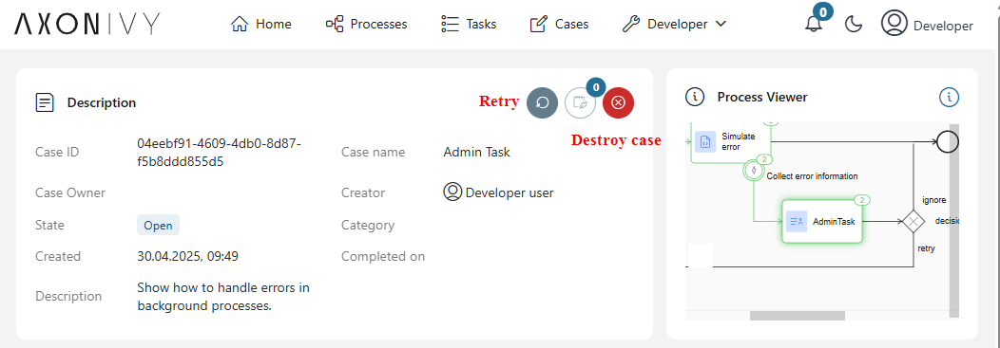

### Komponenten

Diese Demo zeigt ein Muster, mit dem in einer oder mehreren untergeordneten
Komponenten auf ein übergeordnetes Objekt verwiesen werden kann.\
Es verwendet Java-basierte Controller, die in komplexen UI-Szenarien mehr
Flexibilität bieten als Ivy-Prozesse.

Ein Objekt (in diesem Beispiel „ `“ ParentCtrl`) besitzt ein Geschäftsobjekt und
implementiert eine bestimmte Halter-Schnittstelle (in diesem Beispiel „ `“
PersonHolder`), die das Abrufen und Festlegen des Geschäftsobjekts „ `“ Person`
ermöglicht. Andere Controller werden von „ `“ ParentCtrl` erstellt und erhalten
einen Verweis auf „ `“ ParentCtrl` (das „ `“ PersonHolder` ist). Daher haben
beide Controller Zugriff auf „ `“ Person`. Auf diese Weise wird eine Änderung in
der Komponente automatisch auch im übergeordneten Element widergespiegelt und
umgekehrt. Beachten Sie, dass die automatische Aktualisierung auch dann
funktioniert, wenn eine neue Instanz der Person „ `”` von einer beliebigen
Komponente festgelegt wird.

Java-Controller und ähnliche Muster können für viele komplexe Situationen (z. B.
Vererbung) verwendet werden.

### Sperren

Verwenden Sie die LockService-Klasse, um systemweite Sperren für einmalige
Aktionen zu erwerben. Der LockService basiert auf Persistence-Utils und benötigt
eine Datenbankverbindung. Er speichert Sperren in einer optimistisch gesperrten
Entität, um Race-Bedingungen zu vermeiden.

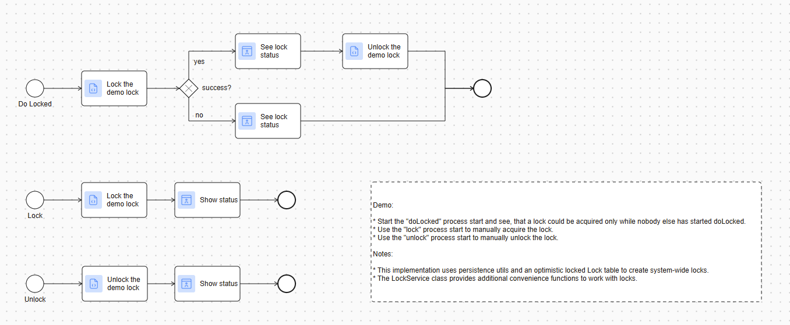

### Job

Verwenden Sie dieses Jobmuster für alle Ihre unbeaufsichtigten Backend-Jobs,
damit diese manuell gestartet werden können. Erstellen Sie für den Fall eines
manuellen Starts oder von Fehlern eine Admin-Aufgabe, damit die Admin-Rolle
entscheiden kann, wie fortzufahren ist.

Das Job-Muster demonstriert einen flexiblen und wiederverwendbaren Ansatz für
die Planung und Verwaltung periodischer Aufgaben innerhalb von Axon Ivy. Dieses
Muster initiiert einen Unterprozess zur Bearbeitung eines Demo-Jobs und bietet
zwei unterschiedliche Methoden zum Auslösen der Ausführung sowie eine robuste
Fehlerbehandlung über das AdminTask-Konzept.

Die enthaltene Demo zeigt ein typisches Szenario für das Job-Muster. Sie
veranschaulicht, wie der Job ausgelöst wird (über Scheduler oder Dialog), wie
ein Fehler simuliert wird (mit `forceError`) und wie die AdminTask die
Behandlung dieses Fehlers mit Optionen wie „Wiederholen” und „Ignorieren”
ermöglicht. Verwenden Sie dies als Ausgangspunkt, um das Muster zu erkunden und
an Ihre Bedürfnisse anzupassen.

Beachten Sie, dass dieses Muster die Muster „ `” (pattern-demos-lock)` und „ `”
(pattern-demos-admintask)` verwendet.

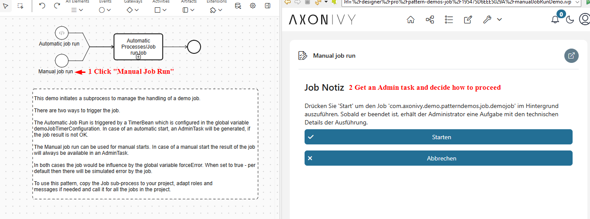

#### Auslösen des Auftrags

- **Geplante Auslösung:** Der Job kann mithilfe eines TimerBean automatisch
  aktiviert werden. Dies wird über die globale Variable
  `demoJobTimerConfiguration` konfiguriert (z. B. `0 0 * * *` für die tägliche
  Ausführung um Mitternacht).
- **Manuelles Auslösen:** Alternativ kann der Auftrag manuell über einen
  Benutzerdialog gestartet werden. Diese Methode bietet Flexibilität nach
  Bedarf, sodass Benutzer den Auftrag jederzeit starten können, wenn dies
  erforderlich ist.

#### Jobverhalten und Fehlersimulation

Die Ausführung des Jobs – ob geplant oder manuell – wird durch die Variable „
`forceError“` in „ `variables.yaml“` beeinflusst. Setzen Sie die Variable auf „
`true“`, damit der Job einen Fehler simuliert. Diese Funktion ist besonders
nützlich, um die Fehlerbehandlungsfunktionen des Musters zu testen. Um eine
erfolgreiche Ausführung zu beobachten, setzen Sie „ `forceError“` auf „
`false“`.

#### Fehlerbehandlung mit AdminTask

Wenn der Auftrag fehlschlägt – entweder aufgrund eines simulierten Fehlers oder
eines tatsächlichen Problems – wird eine AdminTask erstellt, um die Situation zu
bewältigen. Diese Aufgabe wird der Administratorrolle zugewiesen und als ADMIN
kategorisiert und bietet einen Rahmen für Administratorinterventionen. Zu den
verfügbaren Aktionen gehören:

- **Wiederholen Sie den Versuch:** Wiederholen Sie den Auftrag, um ihn
  erfolgreich abzuschließen.
- **Ignorieren:** Verwerfen Sie den Fehler, damit die nächste geplante Instanz
  (falls zutreffend) wie vorgesehen fortgesetzt werden kann.
- **Später prüfen:** Verschieben Sie die Entscheidung, indem Sie die Aufgabe
  abbrechen und sie zur späteren Überprüfung offen lassen.

Diese Optionen sind konzeptionell und müssen an Ihren spezifischen Prozess
angepasst werden. Weitere Informationen zum Anpassen der AdminTask an Ihre
Anforderungen finden Sie im Abschnitt „Admin Task” unter „Setup”.

#### Zusätzliche Funktionen

##### ServiceResult

Das Muster bietet auch eine Klasse `ServiceResult`, mit der mehrere Ergebnisse
gesammelt werden können, was bei regulären Jobs häufig der Fall ist. Verwenden
Sie diese Klasse in Ihrer Job-Implementierung, um die folgenden Meldungen zu
generieren: `OK`, `WARNING` und `ERROR`. Das hier gezeigte Job-Muster generiert
automatisch eine Admin-Aufgabe, wenn ein `ServiceResult` einen nicht OK-Eintrag
enthält.

##### Job-Sperrung

In der Regel werden Jobs ohne Zeitlimit gesperrt gestartet, wobei das Muster „
`pattern-demos-lock` pattern” verwendet wird. Das bedeutet, dass zu einem
bestimmten Zeitpunkt nur eine Instanz eines Jobs ausgeführt werden kann und
Sperren niemals zeitlich begrenzt sind.

##### Stellenbeschreibung

Um zu vermeiden, dass viele Parameter für einen Jobstart angegeben werden
müssen, kann eine `JobDescription` erstellt und in ein Job-Repository eingefügt
werden, wie in dieser Demo gezeigt. Beachten Sie, dass die Ausführung von Jobs
unter dem Namen ihrer `JobDescription` nur funktioniert, nachdem die
`JobDescription` zum Repository hinzugefügt wurde. Dies kann auf verschiedene
Weise erfolgen (StartEventBean, statische Funktionen, ...), und die Demo zeigt
ein einfaches Beispiel mit statischer Initialisierung.

### Parallele Aufgaben

Das parallele Aufgabenmuster dient zur Verwaltung einer dynamischen Anzahl
gleichzeitiger Aufgaben. Der Aufgabengruppe wird eine eindeutige ID zugewiesen,
und die einzelnen Aufgaben werden durch ein Signal gestartet. Die eindeutige ID
wird später verwendet, um das Ende aller Aufgaben zu signalisieren und/oder
Aufgaben abzubrechen, wenn der Administrator dies beschließt.

Die beigefügte Demo veranschaulicht einen praktischen Anwendungsfall:

* Ein Hauptprozess erstellt eine eindeutige ID für die Aufgabengruppe und sendet
  ein Signal, um mehrere parallele Aufgaben auszulösen.
* Diese Aufgaben werden gleichzeitig ausgeführt und simulieren reale
  Arbeitslasten.
* Der Hauptprozess wartet, bis alle Aufgaben abgeschlossen sind, oder ermöglicht
  es einem Administrator, über eine Admin-Aufgabenschnittstelle festgefahrene
  Aufgaben zu überspringen.

In dieser Demo wird jeder Status „FINISHED” direkt in einem benutzerdefinierten
Feld der Aufgabe angezeigt. Wenn eine Aufgabe abgeschlossen ist, wird überprüft,
ob auch alle anderen Aufgaben abgeschlossen sind, indem einfach die Anzahl der
Aufgaben in der aktuellen Gruppe gezählt wird. In realen Szenarien können
Geschäftsobjekte den Gesamtstatus „abgeschlossen” darstellen, oder es kann eine
komplexere Bearbeitung nach Abschluss erforderlich sein (z. B. Stornierung von
Aufgaben aufgrund einer Geschäftsbedingung), sodass das Muster an Ihre
Anforderungen angepasst werden muss.

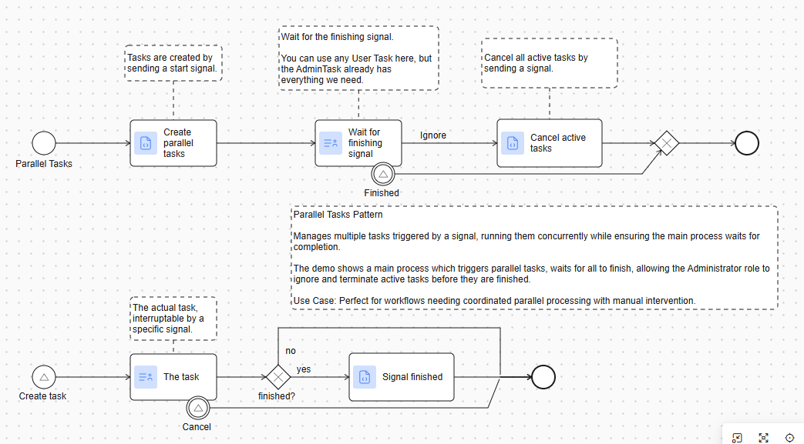

### Platzhalterauswertung

Verwenden Sie diesen einfachen ReplacementService direkt in Ihrem Projekt oder
als Ausgangspunkt für die Implementierung Ihres eigenen textbasierten
Platzhalter-Ersatzes.

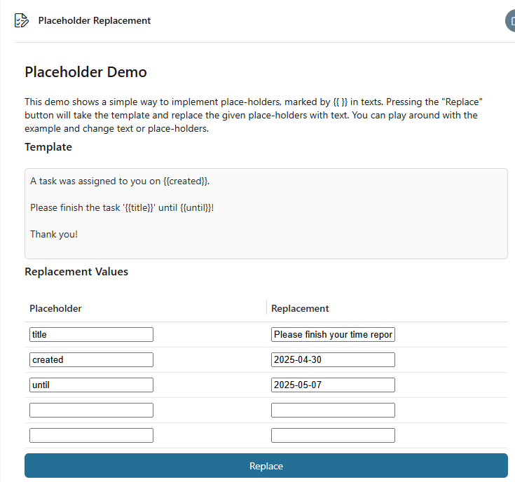

Nach dem Klicken auf „Ersetzen” wurde der folgende Text generiert:

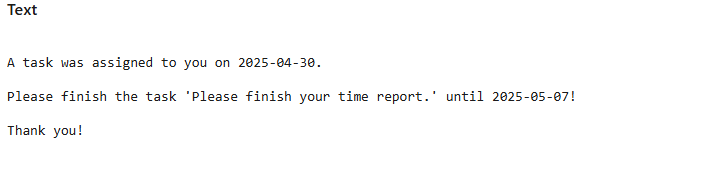

Hinweise:

* Ivy erlaubt die Verwendung von Platzhaltern oder Skriptausgaben bereits in
  bestimmten Elementen.
* DocFactory und Aspose implementieren Mergefields oder Mustache-Platzhalter in
  Word-Dateien.
* Bestehende Java-basierte Platzhalterbibliotheken können zu einem Ivy-Projekt
  hinzugefügt werden.

### Primefaces-Erweiterungen

Anhand dieser Beispiele können Sie sehen, wie Primefaces-Widgets mithilfe der
clientseitigen API von Primefaces angepasst werden können. Diese Demonstration
veranschaulicht, wie die Funktionalität des PrimeFaces InputText-Widgets auf
zwei Arten verbessert werden kann: durch Verfeinerung der Logik der vorhandenen
Methoden und durch Einführung neuer Methoden für das Widget.

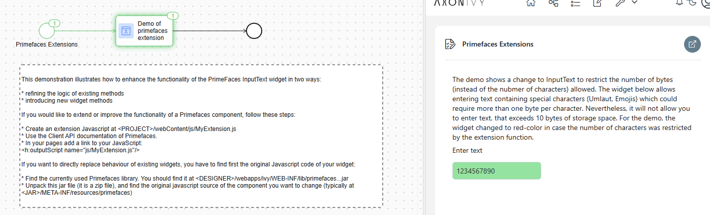

### Validierung

Das Validierungsmuster zeigt einige typische Validierungsszenarien für

* Eine einfache Feldvalidierung ist erforderlich.
* Eine Feldwertvalidierung
* Eine Multi-Feld-Validierung mit Modellzuordnung und serverseitiger Logik.

  Grundlegende Validierung:\
  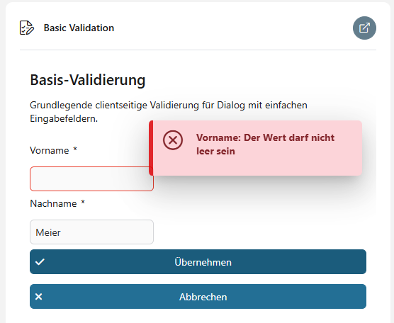

#### Verwaltete Beans

Die verwaltete Bean „ `-messages”` wird verwendet, um benutzerdefinierte
CMS-Meldungen für mehrere Felder auf elegante Weise wiederzuverwenden. Die
verwaltete Bean „ `-constants”` wird verwendet, um Projektkonstanten im Code und
in der Benutzeroberfläche auf elegante Weise wiederzuverwenden.

### Zip-Demo

Diese Demo zeigt ein Beispiel für die Verwendung der Zip-Funktion.

Sie können Dateien von Ihrem Computer hochladen. Diese werden verarbeitet und
automatisch zu einer bestehenden ZIP-Datei hinzugefügt. Wenn keine ZIP-Datei
vorhanden ist, wird eine neue erstellt.\
Klicken Sie auf die Schaltfläche „Herunterladen“, um die ZIP-Datei mit allen von
Ihnen hochgeladenen Dateien herunterzuladen.\
Sie können auch auf „Entpacken“ klicken, um alle Dateien in Ihren lokalen
Designer-Ordner zu extrahieren.

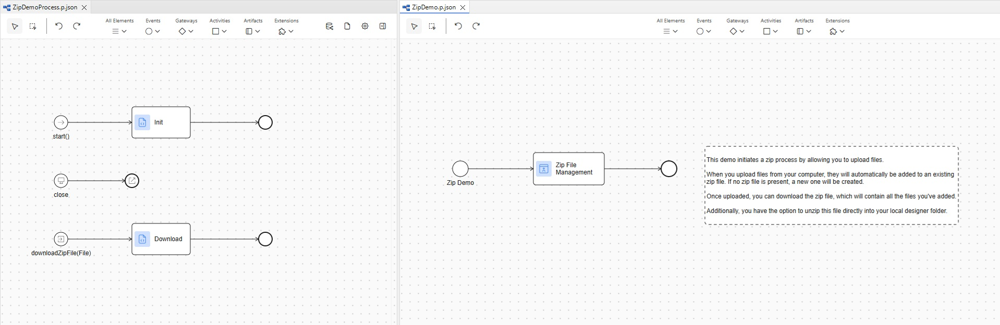

### PDF-Viewer-Demo

Die hochgeladenen Dokumente werden im Speicher abgelegt und in einer Tabelle
angezeigt. Beim Herunterladen oder Anzeigen wird der PDF-Inhalt an die
entsprechende PrimeFaces-Komponente gestreamt.

Um die PDF-Datei anzuzeigen, werden zwei verschiedene Komponenten demonstriert:
* Dokument-Viewer
* Medien

Die Komponente „Document Viewer” ist als PrimeFaces-Erweiterung verfügbar,
während die Medienfunktion im Hauptpaket von PrimeFaces enthalten ist. Die
Funktionen und die Benutzererfahrung beider Komponenten unterscheiden sich.
Verwenden Sie vorrangig „Media” anstelle von „Document Viewer”, da „Media”
schneller ausgeführt wird. Wenn Sie weitere Funktionen nutzen möchten, z. B. das
Bearbeiten von Dokumenten, verwenden Sie „Document Viewer”.

PDF-Viewer-Demo: 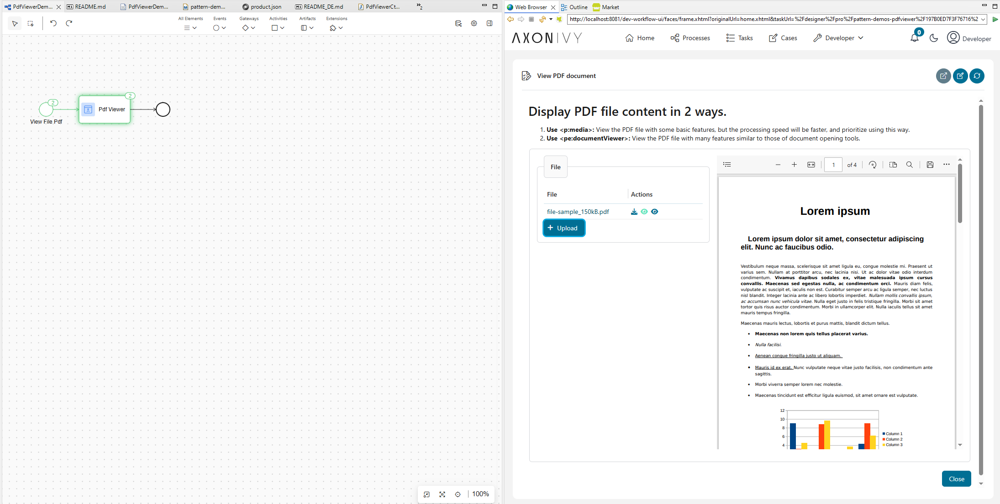

### Warteereignis

Dieses Modul demonstriert ein technisches Muster für die Handhabung der
asynchronen Prozessfortsetzung unter Verwendung von Zwischenereignissen. Es
umfasst zwei primäre Prozesseinträge: **startWaiting**, der einen Prozess
initiiert und ihn in einem definierten Wartezustand unterbricht, und
**fireEvent**, der die Fortsetzung auslöst, indem er auf eine bestimmte
**Event-ID** – eine zufällig generierte UUID – verweist.

Zusätzlich zur internen Aufrufung stellt die Demo einen RESTful-Endpunkt
(„/waiting/fire/{eventId}“) bereit, über den externe Systeme oder Dienste
angehaltene Prozesse durch eine einfache HTTP-GET-Anfrage fortsetzen können.
Dies ist besonders nützlich in Integrationsszenarien, in denen der Prozess auf
einen Rückruf, eine Antwort eines externen Systems oder ein ereignisgesteuertes
Signal warten muss.

Die Lösung ist leichtgewichtig, zustandslos und lässt sich leicht an
verschiedene Geschäftsanforderungen anpassen.

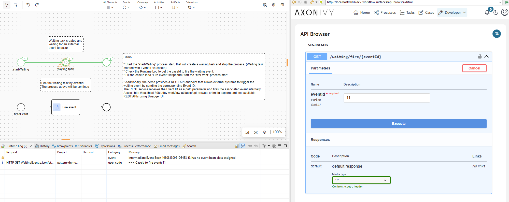

## Einrichtung

Diese Komponente ist ein Repository für wertvolle Muster und Demos. In der Regel
müssen diese an Ihre Projektsituation angepasst werden. Bitte kopieren Sie die
Muster und Beispiele, die Sie verwenden möchten, direkt in Ihr Projekt und
passen Sie sie dort an.

### Admin-Aufgabe

Die AdminTask zeigt ein Konzept und muss an Ihre Bedürfnisse und Einsatzorte
angepasst werden, da sie von Ihrem Prozess abhängt. Die verfügbaren
Schaltflächen können von Fall zu Fall ausgewählt werden, und Sie müssen
überlegen, was „Wiederholen” oder „Ignorieren” in Ihrem Kontext bedeuten würde
oder ob Sie diese Schaltflächen überhaupt zulassen möchten. Standardmäßig hat
die AdminTask „Später prüfen” selbstständig verarbeitet (indem sie die Aufgabe
einfach abgebrochen hat). Um die AdminTask in Ihren Projekten zu verwenden,
kopieren Sie den Dialog in Ihr Projekt, passen Sie ihn an Ihre Bedürfnisse an
und verwenden Sie ihn bei allen Hintergrundaktivitäten, die fehlschlagen könnten
und die Aufmerksamkeit des Administrators erfordern. Die Demo zeigt eine
typische Situation und ein einfaches Beispiel für die Verwendung von
„Wiederholen” und „Ignorieren”.

Beachten Sie, dass die Parameter „task” und „details” von AdminTask persistent
sein sollten (d. h. das Persistenzflag sollte in Ihrer Datenklasse gesetzt
sein). Dies ist erforderlich, damit die Werte verfügbar sind, wenn der
Administrator die Aufgabe später öffnet.

Die Demo weist die Aufgabe der Rolle „Administrator” zu und kategorisiert die
Aufgabe als ADMIN-Kategorie. Passen Sie dies nach Bedarf an.

### Primefaces-Erweiterungen

Diese Demonstration veranschaulicht, wie Sie die Funktionalität des PrimeFaces
InputText-Widgets auf zwei Arten verbessern können:

* Verfeinerung der Logik bestehender Methoden
* Einführung neuer Widget-Methoden

Wenn Sie die Funktionalität einer Primefaces-Komponente erweitern oder
verbessern möchten, gehen Sie wie folgt vor:

* Erstellen Sie eine Javascript-Erweiterung unter
  <PROJECT>/webContent/js/MyExtension.js.
* Verwenden Sie die Client-API-Dokumentation von Primefaces.
* Fügen Sie in Ihren Seiten einen Link zu Ihrem JavaScript hinzu:
  <h:outputscript name="js/MyExtension.js"></h:outputscript>

Wenn Sie das Verhalten bestehender Widgets direkt ersetzen möchten, müssen Sie
zunächst den ursprünglichen Javascript-Code Ihres Widgets finden:

* Suchen Sie die aktuell verwendete Primefaces-Bibliothek. Sie sollten sie unter
  <DESIGNER>/webapps/ivy/WEB-INF/lib/primefaces...jar finden.
* Entpacken Sie diese JAR-Datei (es handelt sich um eine ZIP-Datei) und suchen
  Sie die ursprüngliche JavaScript-Quelle der Komponente, die Sie ändern möchten
  (in der Regel unter <JAR>/META-INF/resources/primefaces).

***Hinweis***: Wenn Sie die Logik einer Komponente ändern, sollten Sie deren
Funktionalität bei jedem Ivy-Update überprüfen, da diese Updates häufig
PrimeFaces-Updates enthalten, die zu Kompatibilitätsproblemen führen können.

