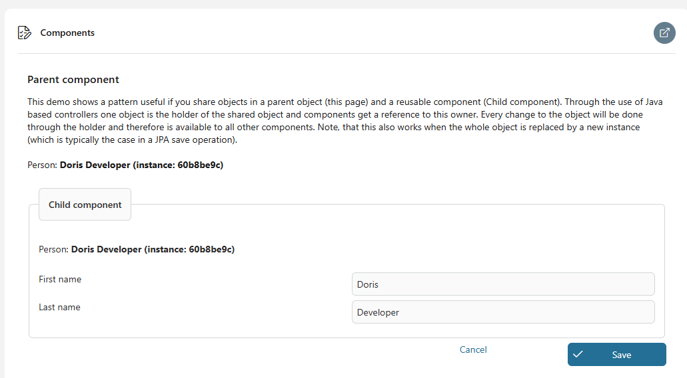

# Muster Demos

Muster Demos sind eine Sammlung Arbeitsgänge, Zwiegespräche, Code, und anderen
#Schnipsel dass haben bewiesen nützlich in unseren Projekten und sind geteilt
öffentlich da best Fahrpraxen durch diese Markt Extension.\
Zu benutzen ein Muster, kopiert die nötigen Teile hinein eure Projekt und
adaptieren ihnen da brauchten. #Während sind behalten die Demos da simpel da
möglich, etwas dürfen bedürfen zuzügliche Infrastruktur in eurem Projekt.

Ausführlich, du willst Lösungen zu den folgenden typischen Problemen finden:
- **Admintask**: Dabei #Im Fall von Fehler Exekution eine admin bekommt einen
  Task und kann beschließen wie zu verfahren.
- **Komponente**: Diese Demo Vorstellungen wie verschiedene Teile von eine
  Nutzer Schnittstelle kann sicher teilen und verbessern #ebensolche #gleich
  #Daten mal #Anschluss- durch einem allgemeinen Controller, sichernd Änderungen
  sind immer herein synchronisieren.
- **Locke**: Verhindert mehrfache Exekutionen von einem Task
- **Beruf**: Dieses Muster hilft du bringst fertig automatisiert backend Berufe
  in #Axon Efeu, mit Optionen zu starten ihnen manuell und Henkel Fehler durch
  admin Tasks—machend Berufe leichter zu regulieren, Monitor, und erholen von
  Misserfolge.
- **Paralleltasks**: Diese Muster Hilfen fertigbringen mehrfache Tasks rennend
  zugleich.
- **Platzhalter**: Tausch aus Platzhalter in Text (gleichnamig `{{name}}`) mit
  real Werte benutzend ein #errichtet-in #bespringen.
- **Primefaceextension**: Benutz diese Beispiele zu sehen wie Primefaces Dinge
  können sein angepasst benutzen die Primefaces Kunden-unterstützen API von
  Dinge.
- **Bestätigung**: Sichert Nutzer Input ist mal richtig überprüfen bedürfte
  Felder, gültige Werte, und Feld Kombinationen.
- **REIßVERSCHLUSS**: Diese Demo zeigt ein Beispiel von wie zu benutzen den
  Reißverschluss Charakterzug.
- **PDFViewer**: Diese Demo Vorstellungen zu #hochladen wie und Ausblick #PDF
  Datei.
- **Wartend Ereignis**: Diese Demo Vorstellungen zu unterbrechen wie eine
  Arbeitsgang Exekution und fortdauern als zu geschehen ein externes Ereignis.

## Demo

### Admin Task

Benutz ein Admin Task zu fangen Fehler herein unbehandelt backend-Berufe. #Im
Fall von Fehler, #ein admin Rolle bekommt einen Task mit den Resultaten und
können beschließen ob sollte den Beruf sein retried oder ließ aus.

Diese Demo schafft eine **Hintergrund Arbeitsgang** gerannt #bei dem System dass
absichtlich löst aus einen Fehler. Der Fehler ist gezeigt herein ein
**AdminTask**, #wo können ein Administrator auswählen zu **Wiederholung** der
Arbeitsgang oder **überhört** den Fehler. Bevor retrying, der Sachverhalt sollte
sein gelöst manuell. In dieser Demo, der "Fehler" kann sein angebracht mal die
globale Variable setzen `forceError` zu `falsch` und dann retrying.

Du kannst **#wiederbenutzen das Zwiegespräch** in eurem eigenen Projekt und
folgen #wann immer dieses Muster du brauchst zu exekutieren Hintergrund
Funktionalität und möchte bedienen #sichtlich Fehler.

> **Note:** Machen sicher das `beharren` #beflaggen ist gesetzt für die
> Parameter `Task` und `Detail`, so verharren sie verfügbar als öffnet den
> Administrator den Task!

### Komponenten

Diese Demo zeigt ein Muster zu erlauben #referenzieren einen Elter besessen
Objekt in #man oder #mehr Kind Komponenten.\
Es benutzt #Java basisbezogen Controller welcher bietet an #mehr Flexibilität
als #Ivy verarbeitet in vielschichtig UI Szenarios.

#Man wendet ein (in diesem Beispiel dem `ParentCtrl`) besitzt ein dienstliches
Objekt und implementiert eine spezifische Fassung Schnittstelle (in diesem
Beispiel dem `PersonHolder`) #welche erlaubt bekommen und setzen von dem
`Person` dienstliches Objekt. Anderen Controller sind geschafft mal die
`ParentCtrl` und bekommen einen Verweis zu den `ParentCtrl` (wer ist den
`PersonHolder`). Deswegen haben beide Controller Zugang zu den `Person`. Hier
eine Änderung in der Komponente will automatisch sein wiedergegeben ebenso in
dem Elter #und umgedreht. Note, dass das automatische Update will arbeiten sogar
als eine neue Instanz von die `Person` ist gesetzt #bei irgendwelcher
Komponente.

#Java Controller und ähnliche Muster können sein benutzt für #viel
vielschichtige Situationen (z.B. Erben).

### Locke

Benutz das LockService Klasse zu aneignen System-weite Locken für #Einweg-
Aktionen. Das LockService ist gegründet auf Beharrlichkeit-utils und braucht
einen Datenbank Zusammenhang. Es speichert herein Locken eine optimistische
verschlossene Entität zu vermeiden Wettrennen-Zustände.

### #Job

Benutz dieses Beruf Muster für jede eure unbehandeltes backend Berufe zu machen
ihnen startable manuell und #im Fall von manuell Start oder Fehler, schafft #ein
admin Task zu lassen den admin Rolle beschließt wie zu fortdauern.

Das Beruf Muster demonstriert ein flexibles und #wiederverwendbar Konzept zu
einplanen und #regelnd periodische Tasks innerhalb #Axon Efeu. Diese Muster
Eingeweihte #ein subprocess zu bedienen einen Demo Beruf, Opfergabe zwei genaue
Methoden zu auslösen Exekution, zusammen mit stabil Fehler bedienen via der
AdminTask Begriff.

Das eingeschlossen Demo Vitrinen ein typisches Szenario für das Beruf Muster. Es
bebildert wie ist #auslösen den Beruf (via #Terminplaner oder Zwiegespräch), wie
ist gespielt ein Misserfolg (benutzend `forceError`), und wie der AdminTask
aktiviert bedienen von jenem Misserfolg mit Optionen gleichnamige "Wiederholung"
und "Überhören." Benutz dies wie ein startend Punkt zu erkunden und anpassen das
Muster für eure Notwendigkeiten.

Note, dass dieses Muster nützt von das `Muster-Demos-Locke` und die
`Muster-Demos-admintask` Muster.

#### #Auslösen den Beruf

- **Fahrplanmäßig #Auslösen:** Der Beruf kann sein automatisch aktivierte
  benutzen ein TimerBean. Dies ist konfiguriert durch der globalen Variable
  `demoJobTimerConfiguration` (#z.B., `0 0 * * ` für täglich Exekution
  #mitternachts).
- **Handbuch #Auslösen:** #Alternativ, der Beruf kann sein gestartet manuell via
  ein Nutzer Zwiegespräch. Diese Methode versieht weiter-Nachfrage Flexibilität,
  erlaubend Nutzer zu anlaufen #wann immer der Beruf nötig.

#### #Job Benehmen und Fehler Simulation

Die Exekution von dem Beruf — eingeplant ob oder Handbuch — ist beeinflusst mal
das `forceError` Variable herein `Variablen.yaml`. Gesetzt das variables zu
`wahr`, zu veranlassen den Beruf zu spielen einen Fehler. Dieser Charakterzug
ist #genauer nützlich für testen das MustersFehler bedienend Fähigkeiten. Zu
einhalten erfolgreiche Exekution, gesetzt `forceError` zu `falsch`.

#### Fehler Bedienen mit AdminTask

Wann der Beruf scheitert—auch dank ein gespielt Fehler oder einen effektiven
Sachverhalt—einen AdminTask ist geschafft zu fertigbringen die Situation.
Zugewiesen zu die Administrator Rolle und kategorisierte da ADMIN, dieser Task
versieht ein Fachwerk für Administrator Intervention. Die verfügbaren Aktionen
einschließen:

- **Wiederholung:** Reattempt Der Beruf zu erreichen erfolgreichen Abschluss.
- **Überhören:** Entlässt den Misserfolg, erlaubend die nächste fahrplanmäßige
  Instanz (ob anwendbar) zu verfahren da geplant.
- **Überprüfen Nachher:** Verschiebt den Entscheid bei streichen aus dem Task,
  behaltend es offen für später Review.

Diese Optionen sind konzeptionell und müssen sein geschneidert zu eurem
spezifischen Arbeitsgang. Übergib zu das "Admin Task" Sektion unter
"Einrichtung" für #mehr Details auf #anpassen die AdminTask für eure
Notwendigkeiten.

#### Zuzügliche Charakterzüge

##### ServiceResult

Das Muster bietet an auch eine Klasse `ServiceResult` welcher kann sein benutzt
zu einsammeln mehrfache Resultate welcher ist oft der Fall in regelmäßig Berufe.
Benutz diese Klasse in eurem Beruf-Ausführung zu generieren `OK`, `WARNUNG` und
`FEHLER` Meldungen. Das Beruf Muster gezeigt hier will generieren #kein Admin
Task ob einen `ServiceResult` zügelt etwas nicht OK Eintrag.

##### Beruf #Abschließen

Typischerweise wollen Berufe sein gestartet verschlossen ohne Zeitüberschreitung
benutzend die `Muster-Demos-Locke` Muster. Dieses Mittel, jener nur eins Instanz
von einem Beruf kann sein rennen #fristgemäß an einem Punkt und Locken wollen
nie Zeitüberschreitung.

##### #Job Steckbrief

Zu vermeiden versehen viele Parameter für einen Beruf startet, einen
`JobDescription` kann sein gebaut und gelegt da hinein einen Beruf
Aufbewahrungsort gezeigt in dieser Demo. Note, jene Laufen Berufe #bei dem Namen
von ihr `JobDescription` will nur arbeiten, #nachdem dem `JobDescription` ist
#zufügen zu dem Aufbewahrungsort. Dies kann sein getan in mehrfach Wege
(StartEventBean, statische Aufgaben,...) Und die Demo Vorstellungen ein simples
Beispiel benutzend statische #Initialisierung.

### Parallele Tasks

Die parallelen Tasks Muster ist gestaltet zu fertigbringen eine dynamische
Nummer von simultan Tasks. Die Task Gruppe ist #zuweisen ein einmaliges id und
die individuellen Tasks sind gestartet #bei einem Signal. Das einmaliges id ist
nachher benutzt zu melden das Ende von alle Tasks und/oder zu streichen Tasks ob
den Administrator beschließt.

Das eingeschlossen Demo bebildert eine praktische Nutzung Fall:

* Ein hauptsächlicher Arbeitsgang schafft ein einmaliges id für die Task Gruppe
  und sendet ein Signal zu auslösen #mehrere parallelen Tasks.
* Diese Tasks exekutieren zugleich, spielend real-Welt Arbeitspensen.
* Der hauptsächliche Arbeitsgang wartet auf alle Tasks zu beenden oder erlauben
  #ein admin zu Sprung starb ab Tasks via #ein admin Task Schnittstelle.

In dieser Demo, jeder Task #bekannt geben es ist "direkt FERTIGER" Zustand in
einem Task #benutzerdefiniert Feld. Wann ein Task ist beendet, es überprüft ob
alle sind beendet anderen Tasks ebenso mal einfach zählend die Nummer Tasks in
der gängigen Gruppe. In real Wort Szenarios, dienstliche Objekte dürfen die
Summe fertig Staat oder More vertreten vielschichtiges Handing nach beenden darf
sein bedürft (#z.B. streichen von Tasks punkto einem dienstlichen Zustand) und
#deshalb zu sein die Muster Notwendigkeiten adaptiert zu euren Forderungen.

### Platzhalter Evaluation

Benutz dieses einfaches ReplacementService direkt in eurem Projekt oder ebenso
zu implementieren einen Start euren eigenen Text-basisbezogene #Ort-Fassung
Auswechselung.

Nach klicken "#Austauschen" den folgenden Text hat gewesen generiert:

Noten:

* #Ivy erlaubt die Nutzung Platzhalter oder #skripten #ausgeben schon in gewiss
  Elemente.
* DocFactory Und Aspose implementieren mergefields oder Schnurrbart Platzhalter
  in Wort Dateien.
* #Existierend #Java-basisbezogene Platzhalter Bibliotheken können sein zugefügt
  zu einem Efeu projiziert.

### Primefaces Extensionen

Benutz diese Beispiele zu sehen wie Primefaces Dinge können sein angepasst
benutzen die Primefaces Kunden-unterstützen API von Dinge. Diese Demonstration
bebildert wie die Funktionalität zu erweitern von die PrimeFaces InputText Ding
in zwei Wege: Mal frischen die Logik von seinen #existierend Methoden und mal
hereinbringen neue Methoden zu dem Ding.

### Bestätigung

Das Bestätigung Muster Vorstellungen einige typische Bestätigung Szenarios für

* Ein simples Feld bedürft Bestätigung
* Ein Feld Wert Bestätigung
* Ein multi-Feld Bestätigung mit Model Vermessung und Server Hang Logik

  Einfache Bestätigung:\
  

#### Fertiggebracht Bohnen

Das fertiggebracht Bohne `Meldungen` sind benutzt da einem eleganten Weg zu
re-benutzt #benutzerdefiniert CMS Meldungen für mehrfach Felder. Das
fertiggebracht Bohne `Konstanten` sind benutzt da einem eleganten Weg zu
re-Nutzung Projekt Konstanten in dem Code und herein dem UI.

### Reißverschluss Demo

Diese Demo zeigt ein Beispiel von wie zu benutzen den Reißverschluss
Charakterzug.

Du kannst Dateien von eurem Computer #hochladen. Sie wollen sein verarbeitet und
automatisch zugefügt zu einem #existierend Reißverschluss Datei. Ob keine
REIßVERSCHLUSS Datei existiert, ein neues will #man sein geschafft.\
Klick den #Herunterladen Knopf zu herunterladen die REIßVERSCHLUSS Datei zügelnd
alle die Dateien #hochladen du.\
Du kannst auch klicken "Auspacken" zu gewinnen alle die Dateien zu eurem lokalen
Designer Ordner.

### #PDF Beschauer Demo

Das #hochladen Dokumente sind gelagert in dem Gedächtnis und gezeigt in einem
Tisch. #Im Fall lädt herunter/ladet herunter es oder #gezeigt, der #PDF Inhalt
ist geströmt zu das #entsprechend PrimeFaces Komponente.

Zu zeigen das #PDF, zwei verschiedene Komponenten sind demonstriert:
* Dokument Beschauer
* Medien

Der Dokument Beschauer Komponente ist verfügbar wie eine PrimeFaces Extension,
#wohingegen ist #einschließen der Medien Charakterzug #großteils PrimeFaces
Päckchen. Die Charakterzüge und UX von beiden Komponenten sind verschieden.
#Priorisieren benutzen Medien über Dokument Beschauer, weil exekutieren Medien
schneller. In Fälle #wo möchtest du benutzen #mehr Charakterzüge, wie bearbeiten
Dokumente, dann Nutzung Dokument Beschauer.

#PDF Beschauer Demo: 

### Wartend Ereignis

Dieses Modul demonstriert ein technisches Muster für bedienen asynchrone
Arbeitsgang Fortsetzung benutzend zwischenzeitliche Ereignisse. Es schließt ein
zwei primären Arbeitsgang Einträge: **startWaiting**, Welcher läuft an einen
Arbeitsgang und unterbricht es an einer #abgesteckt Wartezeit Staat, und
**fireEvent**, welcher löst aus mal die Fortsetzung #referenzieren ein
#Spezifikum **Ereignis ID** — ein #stichprobenweise generierte UUID.

Außer innerparteilich Aufruf, die Demo legt dar einen erholsamen Endpunkt
('/#Bedienen/feuert/{eventId}s) jener aktiviert externe Systeme oder Bedienungen
zu fortfahren mal #abgehängt Arbeitsgänge herausgeben ein simples HTTP BEKOMMT
Bitte. Dies ist #genauer nützlich in Integration Szenarios #wo muss der
Arbeitsgang warten auf einen Rückruf, ein externes System Antwort, oder ein
Ereignis-#getrieben Signal.

Die Lösung ist leichtgewichtig, stateless, und sicher anpassungsfähig zu
verschiedene Geschäft Forderungen.

## Einrichtung

Diese Komponente ist ein Aufbewahrungsort für kostbar Muster und Demos.
Typischerweise müssen sie sein adaptiert zu eure Projekt Situation. Bitte kopier
und adaptieren das pattens und Beispiele dass du möchtest benutzen direkt zu
eurem Projekt.

### Admin Task

Das AdminTask zeigt einen Begriff und muss sein adaptiert zu euren
Notwendigkeiten und Gebrauch-Orte weil hängt ab es auf eurem Arbeitsgang. Die
verfügbaren Knöpfe können sein ausgewählt auf einem Fall-mal-Fall Basis und du
musst denken was eine "Wiederholung" oder eine "Überhört" wollte bedeuten in
eurem Kontext oder ob du beschließt zu erlauben diese Knöpfe es alle. Aus der
Schachtel, der AdminTask bedient "Nachher Kontrolle" bei #sich (mal gerade
streichen aus dem Task). Zu benutzen das AdminTask in euren Projekten, kopiert
das Zwiegespräch zu eurem Projekt, pass an ihm zu euren Notwendigkeiten und
benutzen ihm überhaupt Hintergrund Aktivitäten dass konnten scheitern und
bedürfen Administrator Pflege. Die Demo Vorstellungen eine typische Situation
und ein simples Beispiel von bedienen "Wiederholung" und "Überhören".

Note, dass der Task und Details Parameter von der AdminTask sollte sein ständig
(#d.h. haben die ständige Fahne Apparat in #eure #Daten-#eingruppieren). Dies
ist #damit nötig die Werte wollen sein verfügbar, als die Admin öffnen nachher
den Task.

Die Demo assignes der Task zu den Rolle Administrator und kategorisiert wie den
Task den ADMIN Kategorie. Wechsel ihm zu euren Notwendigkeiten.

### Primefaces Extensionen

Diese Demonstration bebildert wie die Funktionalität zu erweitern von die
PrimeFaces InputText Ding in zwei Wege:

* Frischend die Logik von #existierend Methoden
* #Hereinbringen neue Ding Methoden

Ob du wolltest mögen zu erweitern oder verbessern die Funktionalität von eine
Primefaces Komponente, folg diese Stufen:

* Schaff eine Extension Javascript an <PROJECT>/webContent/js/MyExtension.js
* Benutz den Kunden API Dokumentation von Primefaces.
* In euren Seiten zufügen ein Band zu eure JavaScript: <h:outputscript
  name="js/MyExtension.js"></h:outputscript>

Ob du möchtest direkt Benehmen austauschen von #existierend Dinge, du musst
finden zuerst das originales Javascript Code von eurem Ding:

* Finde das zurzeit benutzt Primefaces Bibliothek. Du solltest finden es an
  <DESIGNER>/webapps/Efeu/WEB-INF/lib/primefaces...Gefäß
* Pack aus diese Gefäß Datei (es ist eine Reißverschluss Datei), und finden das
  originales javascript Quelle von der Komponente möchtest du wechseln
  (typischerweise an <JAR>/META-INF/Ressourcen/primefaces)

**Note**: Ob du modifizierst die Logik von einer Komponente, du solltest seine
Funktionalität mit jedem Efeu überprüfen verbessert, da diese Updates
einschließen oft PrimeFaces verbessern jener konnte resultieren in
Kompatibilität Sachverhalte.

